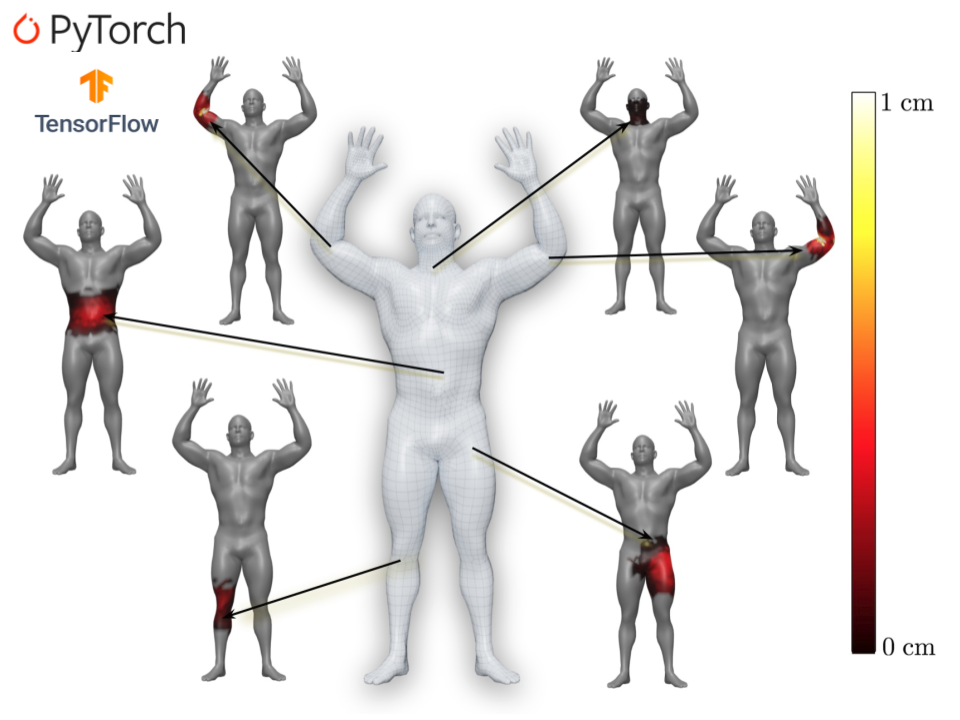
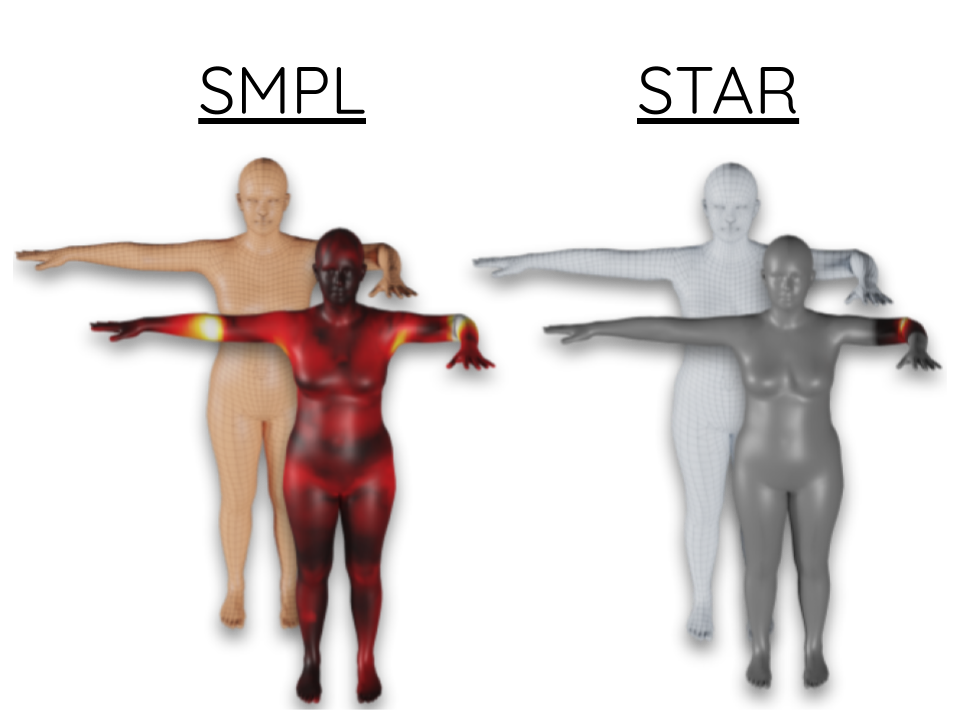
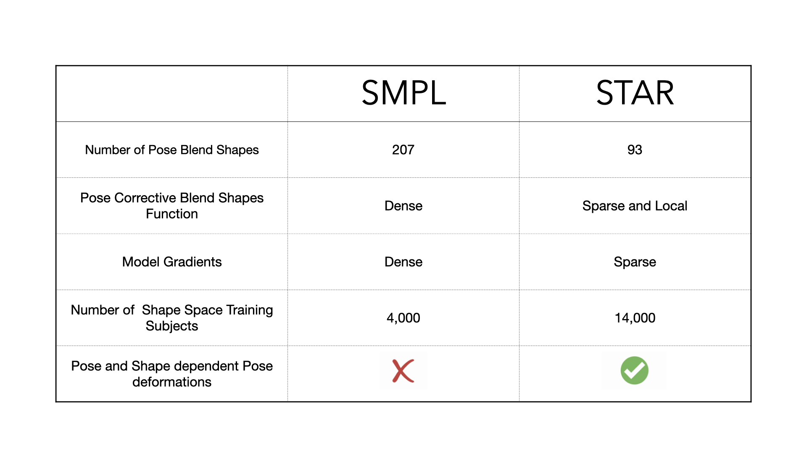
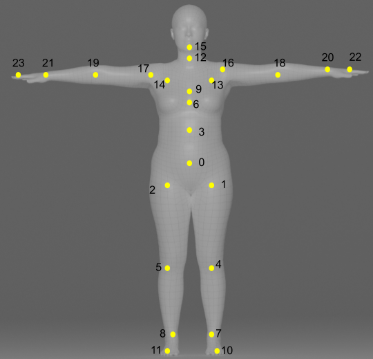

## STAR: Sparse Trained Articulated Human Body Regressor 

<!-- TODO: Replace with our arxiv link -->
<!-- [](https://arxiv.org/abs/1912.05656) -->

[[Project Page](https://star.is.tue.mpg.de/)] 
[[Paper](https://ps.is.tuebingen.mpg.de/uploads_file/attachment/attachment/618/star_paper.pdf)]
[[Supp. Mat.](https://ps.is.tuebingen.mpg.de/uploads_file/attachment/attachment/619/star_supmat.pdf)]

<p align="center">
  
</p>


## Table of Contents
  * [License](#license)
  * [Description](#description)
    * [Content](#content)
    * [Installation and Usage](#Installation)
    * [SMPL Comparison](#SMPLComparison)
  * [Citation](#citation)
  * [Acknowledgments](#acknowledgments)
  * [Contact](#contact)


## License

Software Copyright License for non-commercial scientific research purposes.
Please read carefully the [LICENSE file](https://github.com/ahmedosman/STAR/blob/master/LICENSE) and any accompanying
documentation before you download and/or use the STAR model and
software, (the "Data & Software"). By downloading and/or using the
Data & Software (including downloading, cloning, installing, and any other use
of the corresponding github repository), you acknowledge that you have read
these [terms and conditions](https://github.com/ahmedosman/STAR/blob/master/LICENSE) in the LICENSE file, understand them, and agree to be bound by them. If
you do not agree with these [terms and conditions](https://github.com/ahmedosman/STAR/blob/master/LICENSE), you must not download and/or
use the Data & Software. Any infringement of the terms of this agreement will
automatically terminate your rights under this [License](https://github.com/ahmedosman/STAR/blob/master/LICENSE)


## Description

STAR - A **S**parse **T**rained  **A**rticulated Human Body **R**egressor is a generateive 3D human body model, that is designed to be a drop-in replacement for the widely used SMPL model.
STAR is trained on a large dataset of 14,000 human subjects, with a learned set of sparse and spatially local pose corrective 
blend shapes. In the Figure below, a single joint movement only influences a sparse set of the model vertices. The mesh vertices in 
gray are not affected by the joint movement. In contrast, for SMPL, bending the left elbow causes a bulge in the right elbow.  <br/>
STAR is publicly avaiable with the full 300 principal-component shape space for research purposes from our website https://star.is.tue.mpg.de/

<p align="center">
  
</p>


 For more details, please see our ECCV paper
[STAR: Sparse Trained Articulated Human Body Regressor](https://ps.is.mpg.de/uploads_file/attachment/attachment/618/star_paper.pdf).

## Content
This repository contains the model loader for the following auto-differention frameworks:
* PyTorch. 
* Tensorflow 2.0.
* Chumpy.

Code tested on Python 3.69, CUDA 10.1, CuDNN 7.6.5 and PyTorch 1.6.0, Tensorflow 2.3, Chumpy 0.69 on Ubuntu 18.04

## Installation 

### Install 

We recommend doing the following in a python3 virtual environment.

1. Clone the repository: 

```Shell
git clone git@github.com:ahmedosman/STAR.git
```
2. Install your favorite framework <br/>
Chumpy
```
pip install chumpy==0.69
pip install opencv-python
```

PyTorch
```
pip install pytorch==1.6
```

Tensorflow
```
pip install tensorflow-gpu==2.3
```
5. Download the models from our website https://star.is.tue.mpg.de/

6. Update the model paths in the config.py file.
```python
path_male_star = '/mypath/male/model.npz'
path_female_star = '/mypath/female/model.npz'
path_neutral_star = '/mypath/neutral/model.npz'
```

7. Install with pip
```
pip install .
```

### Usage

Under demos/* there are scripts demonstrating how to load and use the model in all frameworks. 
```bash
    $PATH_TO_REPO/
    ├── demos
    │   │
    │   ├── compare_frameworks.py #Unit test script constructing the model with three frameworks and comparing the output
    │   └── load_chumpy.py        #A script demonstrating loading the model in chumpy
    │   └── load_tf.py            #A script demonstrating loading the model in Tensorflow
    │   └── load_torch.py         #A script demonstrating loading the model in PyTorch
    │   └── profile_tf.py         #A script profiling the STAR graph as a function of batch Size in Tensorflow
    |   └── profile_torch.py      #A script profiling the STAR graph as a function of batch Size in PyTorch
```

## SMPL Comparison 
STAR is designed to be a drop in replacement for SMPL, similar to SMPL it is parameterised with pose and shape parameters, with the same template
resolution and kinematic tree. 

<p align="center">
  
</p>

### STAR Kinematic Tree
<p align="center">
  
</p>


## Citation

If you find this Model & Software useful in your research we would kindly ask you to cite:

```bibtex
@inproceedings{STAR:ECCV:2020,
  title = {STAR: Sparse Trained Articulated Human Body Regressor},
  author = {Ahmed A. A. Osman, Timo Bolkart, Michael J. Black},
  booktitle = {European Conference on Computer Vision (ECCV) },
  month = aug,
  year = {2020},
  month_numeric = {8}
}
```

## Acknowledgments
We thank Naureen M. Mahmood, Talha Zaman,  Nikos Athanasiou, Joachim Tesch, Muhammed Kocabas, Nikos Kolotouros and Vassilis Choutas for the discussions 
and Sai Kumar Dwivedi, Lea Muller, Amir Ahmad and Nitin Saini for proof reading the script and
Mason Landry for the video voice over and Benjamin Pellkofer for the IT support.

## Contact

For questions, please contact [star@tue.mpg.de](mailto:star@tue.mpg.de). 

For commercial licensing (and all related questions for business applications), please contact [ps-license@tue.mpg.de](mailto:ps-license@tue.mpg.de).
